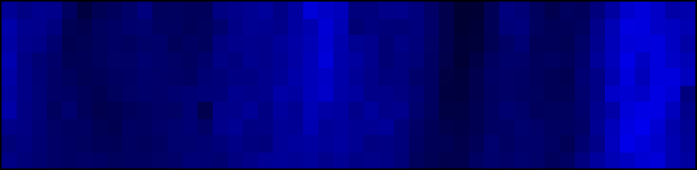
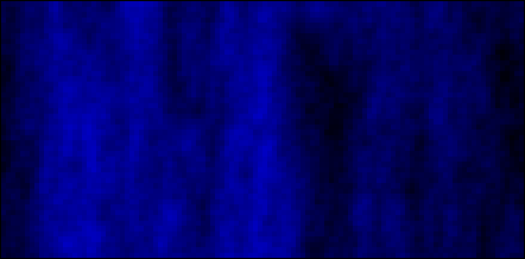
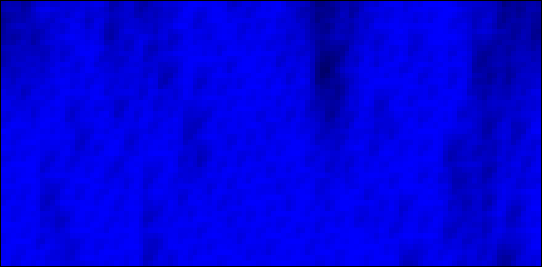
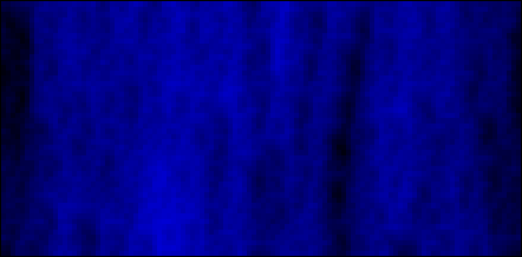
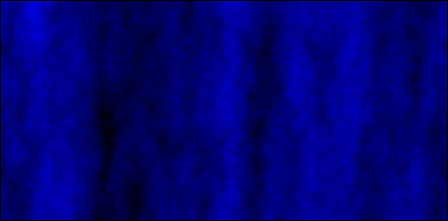

==========
Blue Ocean
==========

The content of this repository is licensed under the MIT License.

.. contents:: **Scripts**

Blue Ocean
==========

   ``blue-ocean-tc.sh`` (24-bit/true color)
   (`YouTube <https://www.youtube.com/watch?v=6uM2dv5siqA>`__)

.. figure:: https://lh6.googleusercontent.com/-6bX5MlTzt3U/UmOwi8arp_I/AAAAAAAAFR8/NS4mmTgMK0U/s800/blue-ocean.sh.gif

   ``blue-ocean.sh`` (256-color)

Elementary cellular automaton
-----------------------------

   Default Rule 150
   (`YouTube <https://www.youtube.com/watch?v=DftJ8GGlPio>`__)

``blue-ocean-eca.sh`` uses `elementary cellular automaton`_ (ECA) to simulate
random depth (blue color value) changes with Bash ``$RANDOM``.  The script
accepts one argument as the ECA rule number, default is 150.  The use of ECA
was inspired by fireplace_.

.. _elementary cellular automaton: https://en.wikipedia.org/wiki/Elementary_cellular_automata
.. _fireplace: https://github.com/Wyatt915/fireplace

The ECA state controls if the blue value randomly (10% of ``$RANDOM``) goes up
or down.  Both ECA cellular tape and the array of blue values are `cyclic tag
system`_, which is unlike previous Blue Ocean scripts, which have edges.

.. _cyclic tag system: https://en.wikipedia.org/wiki/Tag_system#Cyclic_tag_systems

The following screenshots are with different rules:

   `Rule 110 <https://en.wikipedia.org/wiki/Rule_110>`_

   `Rule 30 <https://en.wikipedia.org/wiki/Rule_30>`_

   `Rule 90 <https://en.wikipedia.org/wiki/Rule_90>`_

Gray Canyon
===========

.. figure:: https://lh3.googleusercontent.com/-0k1BMsEqYdQ/UmOwjO1bQqI/AAAAAAAAFR0/IqGQa9sDvQc/s800/gray-canyon.sh.gif

   ``gray-canyon.sh`` (256-color)

Rainbow
=======

.. figure:: https://lh5.googleusercontent.com/-R8KsS2Ekx_s/UmOwjNdp-6I/AAAAAAAAFR4/7JmgxwaRS8A/s800/rainbow.sh.gif

   ``rainbow.sh`` (256-color)
